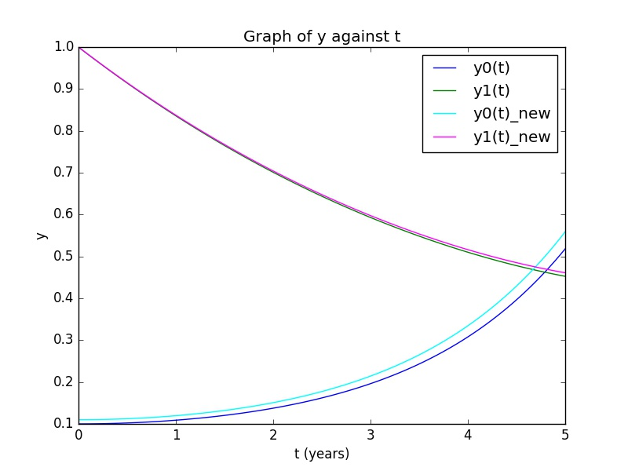

UECM3033 Assignment #3 Report
========================================================

- Prepared by: ONG YEE LENG
- Tutorial Group: T2

--------------------------------------------------------

## Task 1 --  Gauss-Legendre formula

The reports, codes and supporting documents are to be uploaded to Github at: 

[https://github.com/yeeleng/UECM3033_assign3](https://github.com/yeeleng/UECM3033_assign3)

Explain how you implement your `task1.py` here.

Task1 will required the using of numpy.polynomial.legendre.leggauss(n) which will return the node and weight for each node. 
An integral defined over the interval of [a, b] must be changed to an integral defined over the interval [-1, 1] before applying the Gauss-Legendre rule. 
It is because the weights and nodes used in Gauss-Legendre quadrature, are computed based on the interval [-1, 1].
The interval transformation can be done in the following equation, `node_new = (b-a)/2 * node + ((a+b)/2)` as show in the task 1.py.
The answer will be computed using the following equation, `ans = ((b-a)/2) * sum(weight * f(node_new))` as show in the task 1.py.

\\
Explain how you get the weights and nodes used in the Gauss-Legendre quadrature.

The weights and nodes used in the Gauss-Legendre quadrature can be get by `numpy.polynomial.legendre.leggauss(n)`.

---------------------------------------------------------

## Task 2 -- Predator-prey model

Explain how you implement your `task2.py` here, especially how to use `odeint`.

A ODE system (ode) which has 4 parameters (y, t, a, b) is created and the following differential equations is defined in the system. dydt = [a*(y0-y0*y1), b*(-y1+y0*y1)]

Initial values condition is defined as follow, `$y_0(0) = 0.1$, and $y_1 (0) = 1.0$` for part 1 and `$y_0(0) = 0.11$ and $y_1(0) = 1.0$` for part 2.

The time from 0 to 5 years is defined by using linspace function in order to plot a smooth line graph.

`t= np.linspace(0, 5, 100)`

The odeint module in python is used to solve the ODE system. 
The function in python is defined as `sol = odeint(ode, y_0, t, args=(a,b))`.

Put your graphs here and explain.

y0 is the number of prey while y1 is the number of predators.

The is the graph of plotting y against t, the blue color line define the value of y0(t) for initial value of 0.1 while the cyan color line define the value of y0(t) for initial value of 0.11.

The green color line define the value of y1(t) for initial value of 0.1 while the magenta color line define the value of y1(t) for initial value of 0.11.

From the graph, we can observe that the number of prey is decreasing while the number of predators is decreasing over these 5 years period.

Is the system of ODE sensitive to initial condition? Explain.

-----------------------------------

last modified: change your date here
